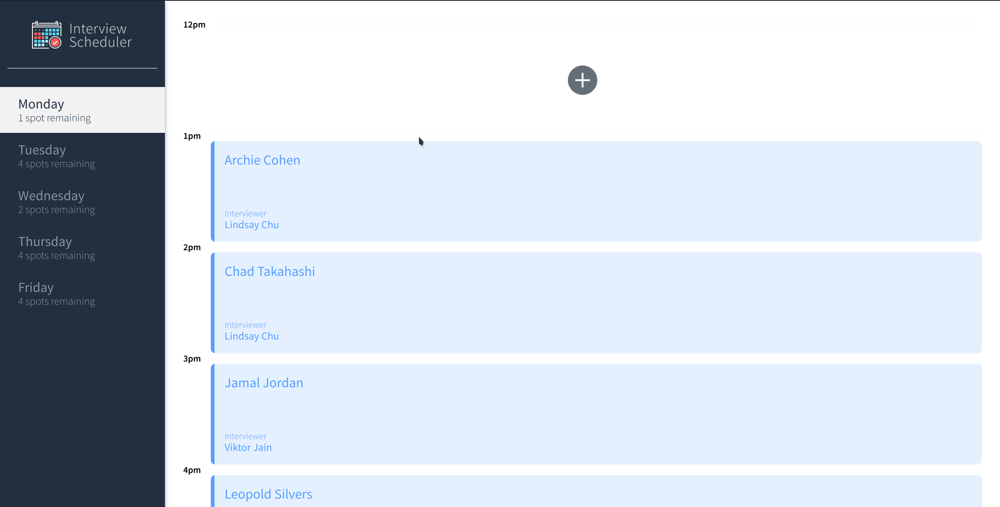
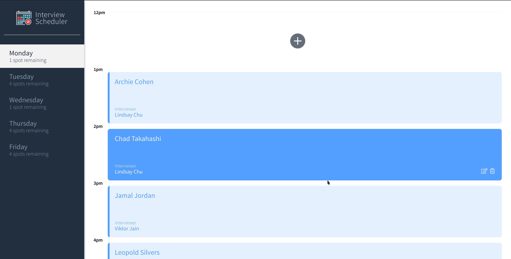
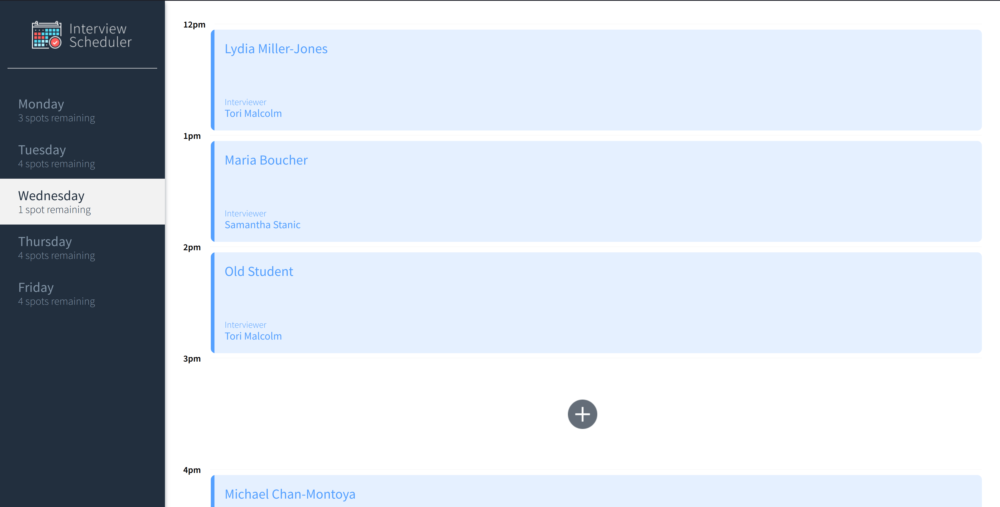

# Interview Scheduler

Interview Scheduler is a single page web application built with React that allows students to book appointments for interviews and select their favourite interviewers.

## Features

- Create a new appointment for a interview
- Edit a existing appointment
- Delete an existing appointment

## Screenshots

### Create a new appointment



### Edit an existing appointment



### Delete an appointment



## Setup

Install dependencies with `npm install`.

## Setting up the API server

https://github.com/zeeplo/scheduler-api

## Running Webpack Development Server

```sh
npm start
```

## Running Jest Test Framework

```sh
npm test
```

## Running Storybook Visual Testbed

```sh
npm run storybook
```
